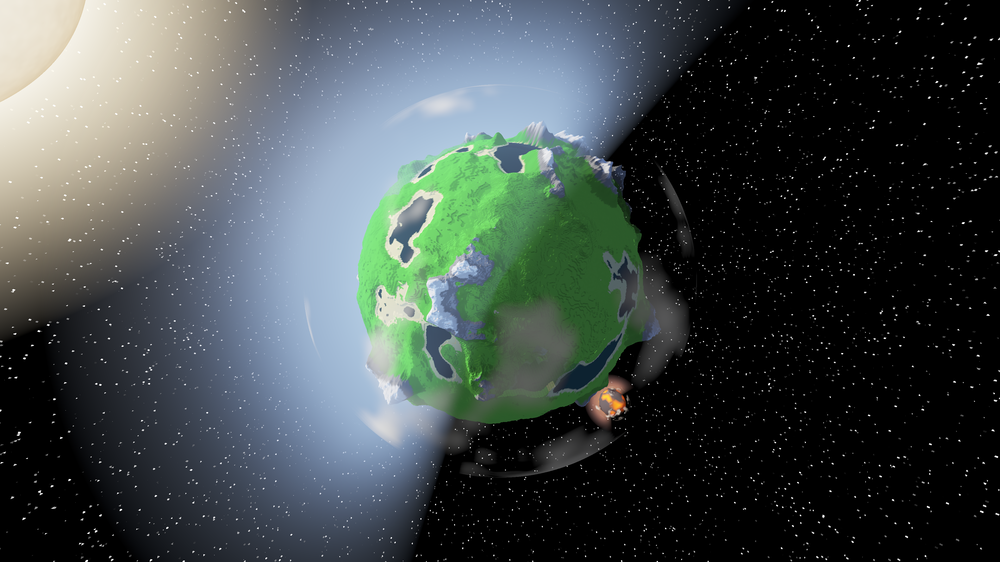

<p align="center">
  
</p>

---

## Key Features

This project is a high-performance voxel engine built from scratch in **Rust**, capable of generating fully explorable, spherical planets in real-time.

*   **Oceans:** Water fills every part of the terrain below sea level. Near the player it is a translucent surface whose colour and opacity follow the water depth (turquoise shallows, deep blue sea), with sky reflection and a sun glint on an animated, rippling surface, and surf foam along the shores; sunlight under water forms moving caustics on the sea floor. You can swim on the surface and dive below it; distant oceans are part of the LOD terrain, and the view gets a blue tint below the surface.
*   **Dynamic Clouds & Atmosphere:** A procedurally shaded cloud layer wraps the planet with no extra geometry: horizon-grazing view rays cross far more of the layer's thickness, so clouds thicken and brighten near the horizon the way real atmosphere does, while a stylised sky gradient gives a blue dome overhead and a glowing atmospheric limb when the planet is seen from orbit. Clouds drift over time, cast moving shadows on the terrain and ocean below, and are reflected on the water's surface.
*   **Spherical Terrain:** Generates a massive, round planet using advanced coordinate mapping (Nowell's Algorithm), eliminating the distortion found in standard cube-map projections.
*   **Multithreaded & Async:** Heavy computational tasks like noise generation and mesh tessellation are offloaded to background thread pools, ensuring a buttery-smooth frame rate.
*   **Custom Rendering Engine:** Powered by **wgpu**, featuring soft sun shadows, exponential atmospheric fog, and HDR tone mapping for photorealistic visuals.
*   **Ray-Traced Shadows without Shadow Maps:** Sun shadows are traced per pixel, either with **hardware ray tracing** on GPUs that support it (Apple M3 and later, NVIDIA RTX, AMD RX 6000 and later) or with a custom **voxel ray march** in the shader as a fallback. Shadow edges stay exact at any distance, with no texel aliasing; the method can be switched at runtime from the console.
*   **Dynamic LOD System:** Implements a recursive Quadtree-based Level of Detail system that renders high-fidelity voxels near the player while optimizing geometry at the horizon.
*   **Custom Physics Engine:** A specialized physics solver designed for spherical gravity, handling collision detection and character orientation on a curved surface.

## Getting Started

Requires a recent stable Rust toolchain and a GPU supported by wgpu (Metal, Vulkan, DX12 or OpenGL).

```sh
cargo run --release
```

Use `--release`, because terrain generation and meshing are much slower in debug builds.

If you're contributing, run `git config core.hooksPath .githooks` once to enable the pre-commit
hook: it formats staged Rust files with `rustfmt` and prints `cargo clippy` output (advisory only,
it won't block a commit).

## Controls

The app starts in first-person mode with the mouse cursor locked to the window.

### Movement & Camera

| Input | Action |
|-------|--------|
| `W` `A` `S` `D` | Move |
| Mouse | Look around (first person) |
| `Q` / `E` | Turn left / right (first and third person) |
| `Space` | Jump |
| `Left Ctrl` (hold) | Sprint (2× speed on foot, 10× while flying) |
| `F` | Toggle fly mode (first person only; fly in the direction you look) |
| `K` | Toggle first/third person (third person also releases the mouse cursor) |
| `Escape` | Release/recapture the mouse cursor without leaving first person (mouse look is detached while released); click back into the view to recapture |
| Mouse wheel | Zoom the camera in/out (third person only) |

### Swimming

In water deeper than about half a block you swim at half the walking speed; you float with your eyes just above the surface.

| Input | Action |
|-------|--------|
| `W` `A` `S` `D` | Swim; `W` follows the look direction, so look down to dive and up to surface |
| `Space` (hold) | Swim up; at the surface, hop out (e.g. onto a ledge) |
| `Left Ctrl` (hold) | Dive |

### Building

| Input | Action |
|-------|--------|
| Left mouse button | Mine the targeted block (the bottom core layers cannot be mined) |
| Right mouse button | Place a block on the targeted face |
| `1` `2` `3` `4` `5` | Choose the block type to place: grass, dirt, sand, stone, snow (shown below the FPS counter) |
| Middle mouse button (wheel click) | Pick the targeted block's type as the block type to place |
| Left mouse button (nothing targeted) | Lock the mouse cursor again (first person) |

### World

| Input | Action |
|-------|--------|
| `]` | Grow the planet (resolution ×1.2) and regenerate terrain |
| `[` | Shrink the planet (resolution ÷1.2) and regenerate terrain |

### Screenshots

| Input | Action |
|-------|--------|
| `F2` | Save the current frame as a PNG to `screenshots/voxanet_<timestamp>.png` (folder created automatically) |

### Console

Press `` ` `` (backtick) to open or close the in-game console. While it is open, keyboard input goes to the console and the mouse cursor is released. Type a command and press `Enter`.

| Command | Description |
|---------|-------------|
| `help` | List available commands |
| `/debug_mode set true\|false` | Enable or disable the debug keys below |
| `/move_speed get` / `/move_speed set <value>` | Read or change walking speed |
| `/jump_force get` / `/jump_force set <value>` | Read or change jump strength |
| `/hw_shadows set true\|false` | Switch between hardware ray-traced and ray-marched shadows (hardware is the default where the GPU supports it) |
| `/screenshot <path>` | Save the current frame as a PNG to a custom path (e.g. `/screenshot captures/shot.png`), instead of the `F2` default location |
| `/view set first\|third` | Switch camera mode from the console |

### Debug Keys (require `/debug_mode set true`)

| Input | Action |
|-------|--------|
| `P` | Toggle wireframe rendering |
| `O` | Toggle collision box visualization |
| `'` | Freeze/unfreeze frustum culling (to inspect culling from outside) |

In debug mode the overlay in the top right also shows chunk/LOD counts and the **GPU time per frame**, split into shadows (ray marching), blur, main pass and text, averaged over one second (on GPUs with timestamp queries).

## Deep Dive for Those Interested

### 1. Core Architecture & Memory Management (System Design)
The engine is built on a **multithreaded ECS-like architecture** designed for high-throughput procedural generation, prioritizing thread safety and zero-cost abstractions.

*   **Asynchronous Mesh Streaming:** Utilizing Rust’s `std::sync::mpsc` channels, I implemented a non-blocking "producer-consumer" model. Heavy operations—specifically Perlin noise generation and vertex tessellation—occur on background thread pools.
*   **Zero-Copy GPU Uploads:** Leveraged the `bytemuck` crate to cast complex internal structs directly into raw byte slices, minimizing CPU overhead during `wgpu::Queue::write_buffer` operations.
*   **Dynamic Resource Management:** Implemented a reference-counted memory system for voxel data, utilizing `HashMap` lookups with spatial hashing (`ChunkKey`) to efficiently manage sparse voxel data across the spherical grid.

### 2. Advanced Rendering Pipeline (Graphics Programming)
The rendering pipeline is constructed using **wgpu (WebGPU)**, featuring a custom WGSL shader pipeline focused on visual fidelity and artifact reduction.

*   **Ray-Marched Sun Shadows (no shadow map):**
    Instead of rendering a shadow map, every pixel traces a ray toward the sun through the voxel grid. The terrain around the player is uploaded as a compact grid of solid/air bits (one bit per block, 32 layers per `u32`) for each cube face, and the fragment shader walks it with a **3D DDA** in block coordinates. Shadow edges are therefore exact block edges at any distance, with no texel aliasing, shimmering, or bias tuning.
    *   The block grid is curved in world space, so the ray is split into short segments and re-linearised per segment; the segment length scales with the planet radius.
    *   Rays crossing a cube-face edge are split there by bisection and continue on the neighbouring face.
    *   8x8-column maximum-height tiles let rays skip segments that pass above all terrain; while a ray keeps climbing above them its step length doubles, so rays over open terrain finish in a few steps.
    *   Rays are cast from a **compute pass** over a G-buffer (world position and normal per pixel), so each visible pixel is traced exactly once and hidden surfaces cost nothing.

*   **Soft Shadow Edges:** The sharp ray-marched shadow term is written to an offscreen texture together with the camera distance and blurred with a separable, **depth-aware** kernel whose radius covers a fixed width in world space. Edges get a soft penumbra at a constant cost per pixel, without bleeding across silhouettes.

*   **Hardware Ray-Traced Shadows:** On GPUs with ray-tracing hardware (e.g. Apple M3 and later, NVIDIA RTX, AMD RX 6000 and later) every chunk mesh gets a bottom-level acceleration structure, and a top-level structure over all loaded chunks is rebuilt each frame. A G-buffer pass stores each shadow texel's world position and normal; a **compute pass** then casts one hardware ray per texel toward the sun. The rays hit the real triangles, so distant LOD terrain casts shadows too. Keeping the ray queries out of the large scene fragment shader was essential: inside it they made every fragment several times slower. In a mountain scene this halves the shadow cost compared to ray marching (5.8 ms vs 11.7 ms on an M4); other GPUs fall back to ray marching.

*   **Resolution-Independent Shadow Cost:** Ray marching costs per pixel, so on large screens the shadow term is computed at no more than 1.5 megapixels and upsampled with a **depth-aware 4-tap filter** (taps weighted by how well their stored camera distance matches the pixel). On a 6K display this cut the frame time from 53 ms to 15 ms with no visible difference, since the soft edges hide the lower shadow resolution.

*   **Deferred Shading:** All scene geometry (about 2 million triangles at high resolution) is drawn once per frame into a G-buffer of vertex colour, normal and camera distance; lighting then runs exactly once per pixel in a full-screen pass, and the shadow passes read their input from the same G-buffer. World positions are reconstructed from the stored distance with a camera ray basis computed in double precision, since an f32 inverse projection is too imprecise for distant terrain. Compared to forward rendering with a separate shadow G-buffer this raised the frame rate by 22-37% in demanding scenes.

*   **Atmospheric Scattering & Tone Mapping:**
    *   Implemented an **Exponential Squared Fog** model ($\displaystyle e^{-(d \cdot \rho)^2}$) to simulate atmospheric depth.
    *   Applied **ACES** approximation for HDR to LDR tone mapping.

*   **Transparency Dithering:** Instead of expensive alpha sorting (which is $\displaystyle O(n \log n)$), I utilized an **Ordered Dithering Matrix** in the fragment shader. This allows for $\displaystyle O(1)$ transparency rendering.

### 3. Spherical Geometry & LOD Algorithms (Math & Terrain)
Unlike standard planar terrain engines, this system generates a fully explorable planet, requiring non-Euclidean mapping techniques.

*   **Cube-to-Sphere Mapping:**
    Implemented the **Nowell Mapping algorithm** to project the voxel grid onto a sphere with minimal distortion. This transforms a unit cube coordinate $(x, y, z)$ into a spherical vector $(x', y', z')$:

$$
x' = x \sqrt{1 - \frac{y^2}{2} - \frac{z^2}{2} + \frac{y^2z^2}{3}}
$$

    This ensures uniform voxel distribution across the planet's surface, solving the "corner clustering" problem found in standard normalization approaches.

*   **Quadtree Spatial Partitioning:**
    Designed a recursive Quadtree algorithm for **Level of Detail (LOD)** management. The system recursively subdivides the planet surface based on the camera's distance relative to the chunk's arc length:
    *   *Heuristic:* `Split if (distance < radius * lod_factor)`
    *   This allows rendering high-resolution voxels near the player while seamlessly transitioning to simplified terrain meshes at the horizon to maintain performance.

*   **Skirt Generation:** To prevent visual "cracks" (T-junction artifacts) between chunks of different LOD levels, the meshing algorithm automatically generates **"skirts"**—geometry extending inwards at chunk borders.

### 4. Physics & Simulation (Custom Solver)
Since the world is spherical, standard physics engines are insufficient as they typically assume a constant gravity vector $\vec{g} = (0, -9.81, 0)$.

*   **Spherical Gravity Alignment:**
    Implemented a kinematic character controller where the "Up" vector is constantly recalculated based on the entity's position relative to the planet center:

$$
\vec{UP} = \text{normalize}(\vec{Position})
$$

*   **Quaternion-Based Orientation:**
    Used quaternion rotation arcs (`Quat::from_rotation_arc`) to smoothly interpolate the player's local coordinate system to match the planet's curvature in real-time.

*   **Discrete Collision Detection:**
    Wrote a custom **AABB** solver that checks for voxel occupancy by casting rays into the underlying math-based terrain grid.
